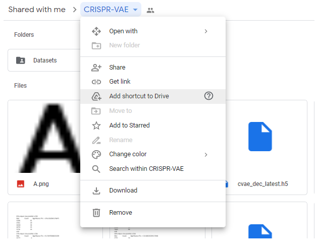

## Contents:

1. The trained CRISPR-VAE weights
2. The trained seqDeepCpf1 weights
3. HT1, HT2, and HT3 datasets, with efficiencies converted to integers
4. The synthetic dataset
5. A, C, G, T .png files for visualization

## Usage:
The manual way is to get the files, and place them in the wanted directory, and make sure all loading instances in the main code are consistent.

Alternatively: 
1. Get the files shared in your drive by clicking the following link:
* https://drive.google.com/drive/folders/1GGFXU_5p8P9LmCE-lA7CCTELIUvJgO_N?usp=sharing
2. Find the folder, and select **> Add shortcut to Drive**
* Example:

* All needed files are imported, and the code is ready to be used
